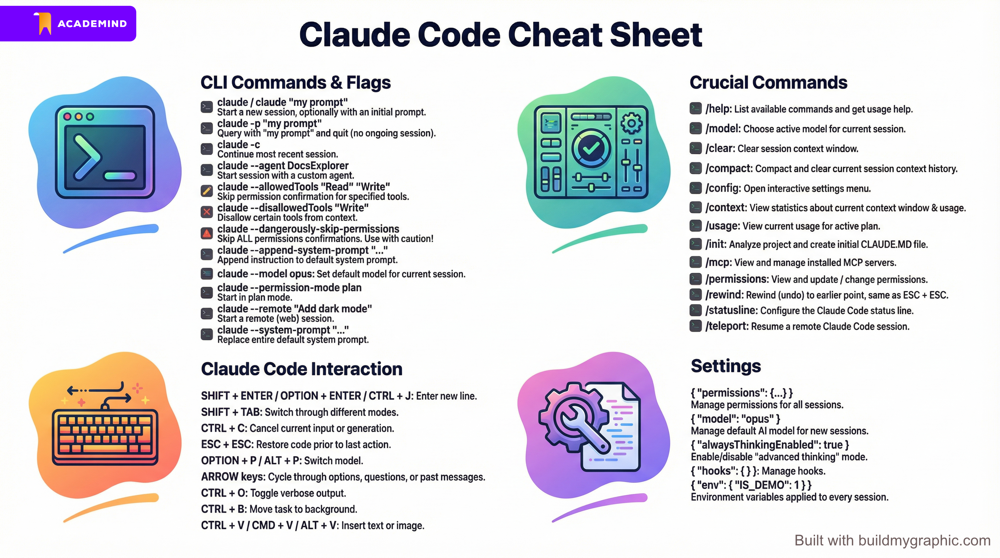
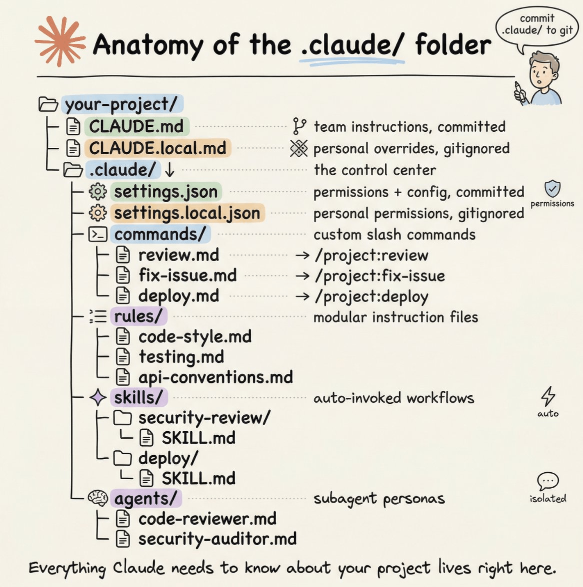
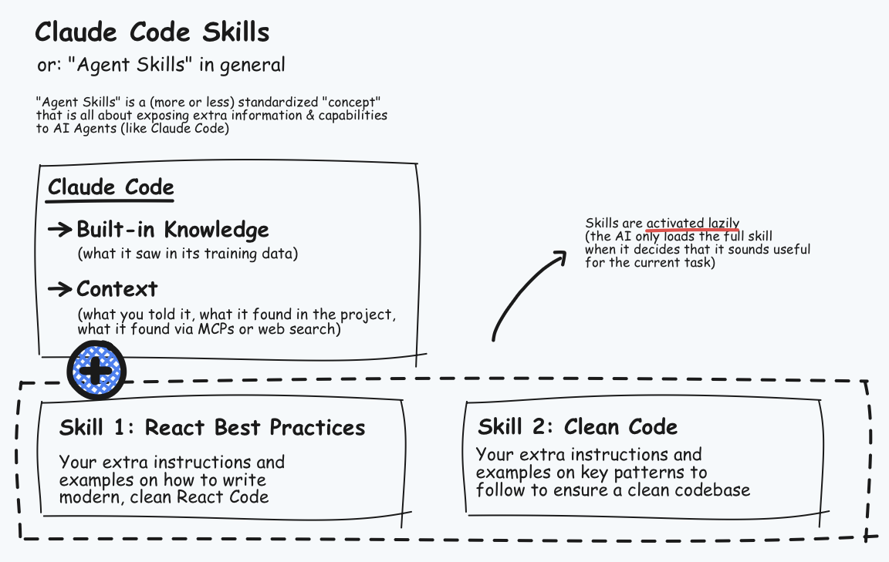

# Claude Code

This directory contains resources related to Anthropic's Claude Code, a powerful tool for interacting with codebases using natural language.

These are the sources I have used:

- [**Udemy: Claude Code - The Practical Guide (Max Schwarzmüller)**](https://www.udemy.com/course/claude-code-the-practical-guide/)
- [Claude Code in Action](https://anthropic.skilljar.com/claude-code-in-action)
- [Introduction to Claude Cowork](https://anthropic.skilljar.com/introduction-to-claude-cowork)
- [Claude 101](https://anthropic.skilljar.com/claude-101)
- [Claude Code Documentation](https://code.claude.com/docs)
- [Claude Code Common Workflows](https://code.claude.com/docs/en/common-workflows)
- [Claude API Quickstarts](https://github.com/anthropics/claude-quickstarts/tree/main)
- [Building with the Claude API](https://anthropic.skilljar.com/claude-with-the-anthropic-api)

Table of contents:

- [Claude Code](#claude-code)
  - [1. Getting Started](#1-getting-started)
    - [Installation and Getting Started](#installation-and-getting-started)
    - [Claude Internal Tools](#claude-internal-tools)
    - [Configuration](#configuration)
    - [Permissions Management](#permissions-management)
    - [Claude's Native Sandbox](#claudes-native-sandbox)
    - [Version Control and Undoing Unwanted Changes](#version-control-and-undoing-unwanted-changes)
    - [Commands, Shortcuts \& Settings Cheatsheet](#commands-shortcuts--settings-cheatsheet)
  - [2. Key Features and Efficient Usage](#2-key-features-and-efficient-usage)
    - [SPEC File](#spec-file)
    - [Prompt and Context Engineering](#prompt-and-context-engineering)
    - [Initializing Claude Projects](#initializing-claude-projects)
    - [CLAUDE.md (equivalent to AGENTS.md)](#claudemd-equivalent-to-agentsmd)
    - [Claude Auto-Memory](#claude-auto-memory)
    - [Plan Mode](#plan-mode)
    - [Web Information](#web-information)
    - [Model Context Protocol (MCP) Servers](#model-context-protocol-mcp-servers)
    - [Subagents](#subagents)
  - [{Library Name}](#library-name)
    - [Key Information](#key-information)
    - [Code Examples](#code-examples)
    - [Skills](#skills)
  - [3. Beyond Local CLI Usage](#3-beyond-local-cli-usage)

## 1. Getting Started

I mainly followed the following course, with its repository:

- [Udemy: Claude Code - The Practical Guide (Max Schwarzmüller)](https://www.udemy.com/course/claude-code-the-practical-guide/)
- [`github.com/academind/claude-code-course-resources`](https://github.com/academind/claude-code-course-resources)

The course has an example project to try the different capabilities of Claude.
That example project is the same as in [`../codex/example-app/`](../codex/example-app/).
That project needs [bun](https://bun.com/docs/installation) installed:

```bash
# Install bun on Mac/Linux
curl -fsSL https://bun.com/install | bash

# Install bun on Windows Powershell
powershell -c "irm bun.sh/install.ps1|iex"
```

However, I skip the project here.

Note: We need a paid subscription.

### Installation and Getting Started

```bash
# Mac, Linux
curl -fsSL https://claude.ai/install.sh | bash
brew install --cask claude-code

# Windows Powershell
irm https://claude.ai/install.ps1 | iex

# Run
cd /path/to/my/project
claude
/login

# Other ways of starting Claude
claude "Analyze the codebase"  # initial prompt given claude starts
claude -p "Analyze the codebase"  # initial prompt given, Claude runs in the background and returns the answer when finished
claude -c  # Resume last session
```

Note that, as in Codex, there are 3 types of interaction interfaces:

- CLI
- Claude App
- IDE

As in codex, we have *slash commands*; here are the most important ones:

```bash
# Conversation
/help     # Show help and available commands
/clear    # Clear conversation history and free up context
/resume   # Resume a previous conversation by ID or name
/rewind   # Rewind conversation to a prior point
/cost     # Show token usage statistics

# Configuration
/config       # Open settings (theme, model, preferences)
/model        # Switch AI model
/permissions  # View or update allowed tools
/vim          # Toggle Vim editing mode
/effort       # Set model effort level (low, medium, high, max)
/status       # Show version, model, and account info

# Output
/copy    # Copy last response to clipboard
/export  # Export conversation as plain text
/diff    # View uncommitted changes interactively

# Modes
/plan    # Enter plan mode to analyze before making changes
/memory  # Edit CLAUDE.md files and manage auto-memory
```

Among them, note these:

- `/clear`: in a session, if we want to start anew, use this to remove history/context. **Use it extensively!**
- `/context`: statistics of the context we have used
  - We see that system prompts & co. can reach up to 10% of all 200k tokens
  - There is an autocompact buffer; autocompact is triggered when we reach 85% of all tokens
- `/usage`: usage statistics shown, i.e., remaining tokens
- `/compact`: we run compaction of the history manually
- `/resume`: start a past session

### Claude Internal Tools

Claude runs these tools available to it:

```
File Operations

- Read -- Read a file's contents (with line numbers)
- Write -- Create or fully overwrite a file
- Edit -- Make targeted string replacements in a file
- Glob -- Find files by pattern (e.g. **/*.py)
- Grep -- Search file contents with regex

Execution

- Bash -- Run shell commands

Research & Web

- WebFetch -- Fetch content from a URL
- WebSearch -- Search the web

Agents & Parallelism

- Agent -- Spawn a specialized subagent (e.g. Explore, Plan, general-purpose) to handle complex subtasks autonomously
- ToolSearch -- Fetch full schemas for deferred/lazy-loaded tools

Task Management

- TaskCreate / TaskGet / TaskList / TaskUpdate / TaskStop / TaskOutput -- Create and manage tasks to track multi-step work

Scheduling & Automation

- CronCreate / CronDelete / CronList -- Manage cron-scheduled jobs
- RemoteTrigger -- Trigger remote scheduled agents

Notebooks

- NotebookEdit -- Edit Jupyter notebook cells

IDE Integration

- mcp__ide__executeCode -- Execute code in the IDE
- mcp__ide__getDiagnostics -- Get IDE diagnostics (errors/warnings)

Notion (MCP)

- notion-fetch, notion-search, notion-create-pages, notion-update-page, etc. -- Read and write Notion content

Planning & Modes

- EnterPlanMode / ExitPlanMode -- Enter a planning mode before making changes
- EnterWorktree / ExitWorktree -- Work in an isolated git worktree

Memory

- Skill -- Invoke a named skill (e.g. /commit, /simplify)

Other

- AskUserQuestion -- Ask the user a clarifying question when genuinely stuck
```

### Configuration

There are 3 main configurations:

- Global: [`~/.claude/settings.json`](~/.claude/settings.json)
- Project: [`.claude/settings.json`](.claude/settings.json); it overwrites the global settings for our project.
- Local: [`.claude/settings.local.json`](.claude/settings.local.json); it overwrites the previous two, the idea is that we don't commit it, so it's our personal.

The *slash command* `/config` modified the **global** settings.

For more info, check: [Claude Code Available Settings](https://code.claude.com/docs/en/settings#available-settings)

### Permissions Management

By default Claude has restricted permissions to edit the files on the current folder; it asks every time and it can only see the current folder.

We can grant permanent folder write permissions with `SHIFT + TAB`. But only for writing files; for instance, `git add` is not granted -- we are still asked.

If `SHIFT + TAB` x2 -> *plan mode*; if 3x -> no extra permissions, no *plan mode*.

An alternative is to choose the option `Yes, don't ask again` when we're asked.

The most permissive (and dangerous) way is to use this flag when starting Claude:

```bash
# All permissions granted: complete RW on our computer
claude --dangerously-skip-permissions
```

A safer alternative is to run Claude in a docker container with all the permissions:

```bash
# Claude Subscription
docker run -it --rm \
  -v "$(pwd)":/workspace \
  -v ~/.claude:/root/.claude \
  ghcr.io/anthropics/claude-code:latest \
  --dangerously-skip-permissions

# API Key
docker run -it --rm \
  -v "$(pwd)":/workspace \
  -e ANTHROPIC_API_KEY="$ANTHROPIC_API_KEY" \
  ghcr.io/anthropics/claude-code:latest \
  --dangerously-skip-permissions
```

### Claude's Native Sandbox

Probably the safest way of auto-allowing commands is running in *sandbox* mode:

- We start Claude with `claude --dangerously-skip-permissions`
- Immediately we activate `/sandbox` with auto-allow
- This updates the `settings.local.json`

The result is that Claude has all the permissions for the current folder, but not outside it. To remove the sandbox, enter `/sandbox` again.

Using the sandbox in combination with `-dangerously-skip-permissions` is probably the best Claude experience.

```json
{
  "sandbox": {
    "enabled": true,
    "autoAllowBashIfSandboxed": true
  }
}

```

### Version Control and Undoing Unwanted Changes

Version control is a must, especially working with agents:

- To undo unwanted changes.
- To run diffs.

There are 2 other ways to restore a change:

- Press `ESC` x2: it rewinds to the desired snapshot.
- *Slash command* `/rewind`: equivalent.

### Commands, Shortcuts & Settings Cheatsheet



## 2. Key Features and Efficient Usage

The course has an example project to try the different capabilities of Claude.
That example project is the same as in [`../codex/example-app/`](../codex/example-app/), and the starter code can be found here: [starting-project.zip](https://github.com/academind/claude-code-course-resources/blob/main/code-snapshots/starting-project.zip).
I won't use the example project.

**Check [Anatomy of the .claude/ Folder](https://blog.dailydoseofds.com/p/anatomy-of-the-claude-folder)**.

Image from that blog post:



### SPEC File

In general, it's a very good idea to create a `SPEC.md` file in every project we work on with Codex or any other agentic framework; it will contain the elaborated project description, worked by leveraging an LLM. It should contain, among others:
- App description
- Tech stack
- Goals and constraints
- Architecture overview (incl. authentication, database, frontend/backend, etc.)
- Routes (UI), connections: e.g., if authenticated redirect to `/notes`, else redirect to `/login`, etc.
- Data models, Database schema
- Example SQL statements
- Pipelines, common workflows for the user
- Error handling and security
- Styling
- Migration
- Environment variables
- Acceptance criteria
- etc.

We should spend time crafting that `SPEC.md` and edit it manually until we are happy with it.

We can use `claude` to clean up the `SPEC.md`; we point to specific files with `@<filename>`, as with Codex. Also, if we want to clearly signal topic sections we can do it with `<topic> ... </topic>`.

```text
We are building an app described in @SPEC.md
Please format that file as proper markdown.
Also use this documentation for the library better-auth:
<better-auth-docs>
[Paste content]
</better-auth-docs>
```

See the example [`SPEC.MD`](../codex/example-app/SPEC.MD).

### Prompt and Context Engineering

A **prompt** is the sum of two things:

- Specific Instructions
- **Relevant** Context

The more precise we are in both, the better.

No extra context should be passed, *in case it is required*.

In that sense, the aforementioned `SPEC.md` is both specific and relevant.

Guidelines:

- Be concise and precise -- describe the task clearly, but omit irrelevant details and fluff.
- Only provide useful context -- don't reference files or docs you think might matter; only include what you know matters.
- Think before you prompt -- plan first, then write your prompt; heavy reliance on follow-ups signals insufficient upfront planning.
- Don't withhold known challenges -- if you know about a pitfall or edge case, share it (and the recommended solution) in your initial prompt.
- Explicitly specify tools -- if a particular tool or feature should be used, say so; don't assume the AI will pick it automatically.
- Core theme: you are in control -- the quality of AI output is largely determined by how well you steer it.

### Initializing Claude Projects

First, we should define our environment and install all necessary packages, e.g., with conda/uv/poetry/pip.

Then, we `resume` and `/clear` our session.

Finally, we run `/init`, which analyzes the current codebase (which contains the `SPEC.md` and maybe some starter structure) and creates the `CLAUDE.md` file.

The more context Claude has the better for `CLAUDE.md`.

### CLAUDE.md (equivalent to AGENTS.md)

`CLAUDE.md` is equivalent to `AGENTS.md` in Codex, and it's create the same way: via `/init`.

We should have at least one of these in the root folder, and every new session we create/clear will load it.

We should spend time editing this `CLAUDE.md`:

- Be as brief as possible
- Include general but important information
- etc.

```text
This app aims to build X.

The specification is in @SPEC.md, read it.

Behavior guidelines: give short answers, ...

Commands...

Architecture...

Key dependencies...
```

We can add a `CLAUDE.md` file in each subfolder; these are loaded & read only if Claude edits the files in those subfolders.

### Claude Auto-Memory

`CLAUDE.md` is general *memory* maintained by the user.

In addition to that, Claude automatically stores more information in `~/.claude/projects/<project>/memory/MEMORY.md`, which contains topic specific memories, such as:

- Preferred style
- Errors it made
- ...

So it tries to learn from the interaction.
The file is kept concise.
Claude loads parts (first 200 lines) in every new conversation. 
We should not edit it.

We can toggle off/on this via `/memory`.

### Plan Mode

Once our `SPEC.md` is defined, we can start implementing with the first prompt; for the first prompt, it is recommended:

- To ask a first limited version, or specific parts only and dummy structures for the rest.
- To use *plan mode*, which is triggered with `SHIFT + TAB` x2 or `/plan`.

Plan mode asks questions and turns *bad prompts* into *good prompts*.

Note that plans are saved temporarily in `.claude/`.

When the plan is finished, it is displayed and we are asked:

- If we accept it and it should continue
- If we want changes
- etc.

We should be as precise as possible reviewing the plan to our needs.

### Web Information

When we are iterating our development, if specific documentation is needed, we need to provide it; there are 3 ways:

- We copy and paste the relevant documentation: `<documentation> [Pastes X characters] </documentation>`
- We provide the link: `Use this URL: X`; **unlike Codex, Clause has web search by default!**
- We use an MCP server with the documentation

### Model Context Protocol (MCP) Servers

[Model Context Protocol (MCP)](https://modelcontextprotocol.io/docs/getting-started/intro) Servers are a standardized way of exposing tools to LLMs.

We can build our MCP servers or use exiting ones.

There is one MCP server which serves many up-to-date documentation pages of different tools: [Context7](https://context7.com/); that way, we can use it instead of allowing live web search. This makes sense for hot or trendy new libraries, like [better-auth](https://github.com/better-auth/better-auth), used in the example app.

In general, we should carefully add MCP servers, because agents (LLMs) tend to get worse if we expose them to too many MCP servers; so we should use the ones we only know we need. Some other interesting MCP servers:

- [Playwright](https://github.com/microsoft/playwright-mcp?tab=readme-ov-file), to give Codex browser access.
- [DeepWiki](https://docs.devin.ai/work-with-devin/deepwiki-mcp), to give Codex search access to essentially ALL GitHub repositories.

To install or connect to that server, we can check the documentation to the different clients: [Context7: MCP Clients](https://context7.com/docs/resources/all-clients#claude-code).

```bash
# Local Server Connection: That's the one we need
# We can remove the API_KEY part, since it's not necessary
# We can use a Context7 API key for higher usage, but it's not compulsory
claude mcp add --scope user context7 -- npx -y @upstash/context7-mcp [--api-key YOUR_API_KEY]
claude mcp add --scope user context7 -- npx -y @upstash/context7-mcp
claude mcp add --scope user context7 --scope user -- npx -y @upstash/context7-mcp  # Install globally
# Added stdio MCP server context7 with command: npx -y @upstash/context7-mcp to user config
# File modified: $HOME/.claude.json

# Remote Server Connection
claude mcp add --scope user --header "CONTEXT7_API_KEY: YOUR_API_KEY" --transport http context7 https://mcp.context7.com/mcp
```

Then, in the session, we check the MCP servers:

```bash
/mcp
# context7 should appear, among others
```

To use an MCP server, we mention it in the prompt:

```text
# Plan mode
Use the context7 MCP to find teh relevant documentation on better-auth
# Then, check the plan, iterate, etc.
```

### Subagents

Claude has out-of-the-box subagents, which are automatically spawn when we request something; for instance the `Explore()` subagent. We can see how these subagents perform tasks in parallel in the CLI, because they output concurrent streams. Then, when a subagent finishes, its outputs are integrated to the context.

We can also create custom subagents. It make sense to create subagents when their tasks are modular/independent, and they can work without polluting the main thread's context! That's the key idea: a new sub-session is launched for the subagents and our main session context is not bloated.

To create a subagent, we place a Markdown with the agent description in `.claude/agents` or `~/.claude/agents`:

```bash
# Local project
.claude/
  agents/
    DocsExplorer.md  # Agent description

# Global: available to all projects
~/.claude/
  agents/
    DocsExplorer.md  # Agent description
```

The file [`DocsExplorer.md`](https://github.com/academind/claude-code-course-resources/blob/main/other/subagent/DocsExplorer.md) has a preamble with specific properties:

- name: Same as the MD file
- description: very important, Claude decides to spawn the subagent based on this description
- [tools](https://code.claude.com/docs/en/tools-reference): we provide the subagent with available tools; don't forget `MCPSearch`
- model: opus / sonnet / haiku; depending on the complexity of the task

And then, the content is a regular MD similar to this:

```markdown
---
name: DocsExplorer
description: Documentation lookup specialist. Use proactively when needing docs for any library, framework, or technology. Fetches docs in parallel for multiple technologies.
tools: WebFetch, WebSearch, Skill, MCPSearch
model: sonnet
---

You are a documentation specialist that fetches up-to-date docs for libraries, frameworks, and technologies. Your goal is to provide accurate, relevant documentation quickly.

## Workflow

When given one or more technologies/libraries to look up:

1. **Execute ALL lookups in parallel** - batch your tool calls for maximum speed
2. **Use Context7 MCP as primary source** - it has high-quality, LLM-optimized docs
3. **Fall back to web search** when Context7 lacks coverage
4. **Prefer machine-readable formats** - llms.txt and .md files over HTML pages

## Lookup Strategy

### Step 1: Context7 MCP (Primary)

For each library, call these in sequence:

1. `mcp_Context7_resolve-library-id` with the library name to get the Context7 ID
2. `mcp_Context7_query-docs` with the resolved ID and specific query

Run Step 1 for ALL libraries in parallel.

### Step 2: Web Fallback (If Context7 fails or lacks info)

If Context7 doesn't have the library or lacks specific info:

1. **Search for LLM-friendly docs first:**
   - Search: `{library} llms.txt site:{official-docs-domain}`
   - Search: `{library} documentation llms.txt`

2. **Try known llms.txt paths:**
   - Navigate to `{docs-base-url}/llms.txt`
   - Navigate to `{docs-base-url}/docs/llms.txt`
   - Navigate to `{docs-base-url}/llms-full.txt`

3. **Try .md documentation paths:**
   - Search: `{library} {topic} filetype:md site:github.com`
   - Navigate to `{docs-base-url}/docs/{topic}.md`
   - Navigate to `{docs-base-url}/{topic}.md`

4. **Final fallback - fetch normal page:**
   - If no llms.txt or .md found, navigate to the official docs page
   - Use browser_snapshot to extract content

## Parallel Execution Rules

- When looking up multiple libraries, start ALL Context7 resolve-library-id calls simultaneously
- After resolving IDs, batch all query-docs calls together
- For web fallback, batch navigate calls for different libraries
- Never wait for one library lookup to complete before starting another

## Output Format

For each library/technology, provide:

```
## {Library Name}

**Source:** {Context7 | URL}

### Key Information
{Relevant docs content, API references, examples}

### Code Examples
{Practical code snippets from the docs}
```
```

If we consider a subagent is very important, we can mention it in the `CLAUDE.md`:

```text
Whenever working with any third-party library or something similar, you MUST look up the official documentation to ensure that you're working with up-to-date information.
Use the DocsExplorer subagent for efficient documentation lookup.
```

### Skills

Agent skills are already a standard: [Agent Skills Standard](https://agentskills.io/home).



The standard defines a folder structure for skills, which is the following:

```bash
# Local project
.claude/skills/
    <skill-name>/
    ├── SKILL.md          # Required: instructions + metadata
    ├── scripts/          # Optional: executable code
    ├── references/       # Optional: documentation
    └── assets/           # Optional: templates, resources

# Glocal: skills should be maybe project-specific though?
~/.claude/skills/
    <skill-name>/
    ├── SKILL.md          # Required: instructions + metadata
    ├── scripts/          # Optional: executable code
    ├── references/       # Optional: documentation
    └── assets/           # Optional: templates, resources
```

Note: that's not the standard; Codex and other frameworks also allow defining the skills inside the `.agents/skills/` folder for compatibility with other agentic frameworks.

In any case, as we see, a skill is basically defined in a `SKILL.md` file inside its `<skill-name>/` folder. Then, we can optionally add scripts, references, and assets.

We could write in the `CLAUDE.md` file the skill description, but `CLAUDE.md` could become huge and it is loaded every time taking space in the context.
**The main idea with `SKILL.md` is that the files are LAZY-loaded, i.e., they are loaded only when needed!**
That way `CLAUDE.md` is kept lean and contains only general at all times **relevant** knowledge.

> Skills use progressive disclosure to manage context efficiently:
> - Discovery: At startup, agents load only the name and description of each available skill, just enough to know when it might be relevant.
> - Activation: When a task matches a skill’s description, the agent reads the full SKILL.md instructions into context.
> - Execution: The agent follows the instructions, optionally loading referenced files or executing bundled code as needed.
> This approach keeps agents fast while giving them access to more context on demand.

The `SKILL.md`:

- It contains a preamble with the important fields `name` and `description`.
- Inside the body text, we can make reference to a `reference/ref-doc.md` file, if more information should be consulted; this will be loaded if needed.
- Look at the examples in [`.claude/skills/`](.claude/skills/).

See the official Claude documentation for more details: [Extend Claude with skills](https://code.claude.com/docs/en/skills)

Once the skills are defined, we can use them as follows:

- We write a prompt which clearly requires a defined skill, and Claude should detect it by knowing the skill name and descriptions.
- The skills appear as *slash commands* automatically, they are usually not thought to be invoked explicitly, though; 

## 3. Beyond Local CLI Usage


