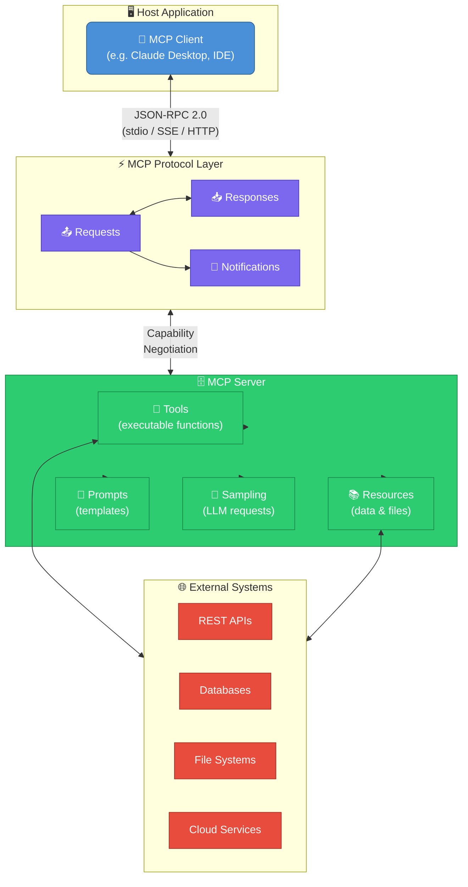
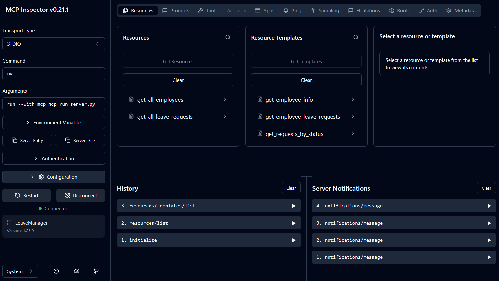

# Model Context Protocol (MCP)

This is a collection of notes on the Model Context Protocol (MCP), a protocol for connecting AI models to external tools and data sources. MCP allows AI agents to access a wide range of capabilities and information, enabling them to perform complex tasks and make informed decisions.

Courses and resources on MCP:

- [Udemy: Intro to MCP - Model Context Protocol (Claude)](https://www.udemy.com/course/intro-to-mcp-model-context-protocol-claude/)
- [FastMCP](https://gofastmcp.com/getting-started/welcome)
- [Udemy: MCP Crash Course: Complete Model Context Protocol in a Day (Eden Marco)](https://www.udemy.com/course/model-context-protocol/)
- [Udemy: Learn MCP - Model Context Protocol Complete Guide](https://www.udemy.com/course/learn-mcp-model-context-protocol-complete-guide/)
- [Docker Just Made Using MCP Servers 100x Easier (One Click Installs!)](https://www.youtube.com/watch?v=TxlVdB2gmGE)

Table of Contents:

- [Model Context Protocol (MCP)](#model-context-protocol-mcp)
  - [Introduction to MCP](#introduction-to-mcp)
    - [MCP Architecture](#mcp-architecture)
      - [How the Pieces Relate](#how-the-pieces-relate)
      - [GitHub MCP Example](#github-mcp-example)
    - [Quick FastMCP Implementation Concepts](#quick-fastmcp-implementation-concepts)
      - [Tools](#tools)
      - [Resources](#resources)
      - [Prompts](#prompts)
      - [Sampling](#sampling)
      - [Summary](#summary)
    - [Example: First MCP Setup - Calculator MCP Server](#example-first-mcp-setup---calculator-mcp-server)
        - [Tools](#tools-1)
        - [Setup](#setup)
        - [Server Code](#server-code)
        - [Running the server](#running-the-server)
        - [Install the Server Tool in the Client](#install-the-server-tool-in-the-client)
        - [Test the tool in the client](#test-the-tool-in-the-client)
        - [Uninstalling and Managing the Server Tool in the Client](#uninstalling-and-managing-the-server-tool-in-the-client)
    - [Example: Leave Management MCP Server](#example-leave-management-mcp-server)
      - [Setup](#setup-1)
      - [Server Code](#server-code-1)
        - [Running the server](#running-the-server-1)
        - [Install the Server Tool in the Client](#install-the-server-tool-in-the-client-1)
        - [Test the tool in the client](#test-the-tool-in-the-client-1)
    - [Example: Project Management MCP Server](#example-project-management-mcp-server)
  - [Docker MCP Toolkit](#docker-mcp-toolkit)

## Introduction to MCP

Most of the content in this section is sourced from the following course:

[Udemy: Intro to MCP - Model Context Protocol (Claude)](https://www.udemy.com/course/intro-to-mcp-model-context-protocol-claude/)

The course repository: [GitHub MCP Projects](https://github.com/whyashthakker/mcp-projects)

Relevant sources:

- [Anthropic: Model Context Protocol](https://www.anthropic.com/news/model-context-protocol)
- [Model Context Protocol Documentation](https://modelcontextprotocol.io/docs/getting-started/intro)

> MCP (Model Context Protocol) is an open-source standard for connecting AI applications to external systems.
> Using MCP, AI applications like Claude or ChatGPT can connect to data sources (e.g. local files, databases), tools (e.g. search engines, calculators) and workflows (e.g. specialized prompts)--enabling them to access key information and perform tasks.

Also, MCPs provide a secure way to connect AI models to external tools and data sources, without giving them direct access to the underlying systems. This allows for greater control and security when using AI agents.

### MCP Architecture



#### How the Pieces Relate

**Client <-> MCP Protocol** -- The client (e.g. Claude Desktop or an IDE plugin) speaks **JSON-RPC 2.0** over one of three transports: `stdio`, `SSE`, or `HTTP`. It sends *Requests*, receives *Responses*, and reacts to *Notifications* pushed by the server. The client never calls external systems directly.

- JSON-RPC 2.0 is a simple, language-agnostic protocol for remote procedure calls.
- `stdio` is a simple, synchronous communication channel using standard input and output streams.
- `SSE` (Server-Sent Events) is a unidirectional streaming protocol ideal for real-time updates.
- `HTTP` is a request-response protocol suitable for stateless interactions.

**MCP Protocol <-> Server** -- Before any real work happens, the two sides exchange a **capability negotiation** handshake. The server declares which of its four capability types it supports; the client learns exactly what it can ask for. This makes the protocol extensible without breaking older implementations.

**Server -> Tools / Resources / Prompts / Sampling** -- A server exposes up to four capability classes. Three of them (Tools, Resources, Prompts) are declared with Python decorators and respond to requests *from* the client. Sampling is the exception: it has no decorator and works in the opposite direction — the server calls back into the client's LLM.

- **Tools** -- callable functions the model can invoke to perform actions or computations (e.g. `create_issue`, `search_code`). Declared with `@mcp.tool()`. Direction: client --> server.
- **Resources** -- read-only data the model can pull into context (e.g. a file, a DB row). Declared with `@mcp.resource("uri://pattern")`. Direction: client --> server.
- **Prompts** -- reusable prompt templates the client can request and inject into the conversation. Declared with `@mcp.prompt()`. Direction: client --> server.
- **Sampling** -- lets the server ask the *client's* LLM to generate text. No decorator; invoked from inside a tool or resource via `await ctx.sample(...)`. Direction: server --> client.

**Server <-> External Systems** -- Tools and Resources are the bridge to the real world -- REST APIs, databases, file systems, cloud services.

#### GitHub MCP Example

```
Claude Desktop (Client) -- JSON-RPC --> github-mcp-server (MCP Server) -- REST --> api.github.com (External)
```

1. You ask Claude: *"Open an issue in my repo for the login bug."*
2. Claude (the **Client**) sends a `tools/call` request through the **Protocol** layer with tool name `create_issue` and arguments `{ repo, title, body }`.
3. The **GitHub MCP Server** receives it, authenticates with a stored token, and calls `POST /repos/{owner}/{repo}/issues` against the GitHub REST API.
4. GitHub returns the new issue URL -> the server wraps it in a JSON-RPC **Response** -> Claude reads it and tells you: *"Done! Issue #42 is open."*

Other tools the GitHub MCP server typically exposes: `list_repos`, `get_file_contents`, `create_pull_request`, `search_code`, `list_commits` -- all following the exact same Client --> Protocol --> Server --> External flow.

### Quick FastMCP Implementation Concepts

All four capability types are implemented as plain Python functions. The key differences are the decorator used and the direction of the call.

#### Tools

Invoked by the client to perform an action. Can read and write state. Returns a result to the client.

```python
@mcp.tool()
def add(a: int, b: int) -> int:
    """Add two numbers."""
    return a + b
```

#### Resources

Invoked by the client to read data. Semantically read-only. The URI pattern can include path parameters.

```python
# @mcp.resource("uri://{param}")
@mcp.resource("employee://{employee_id}")
def get_employee(employee_id: str) -> str:
    """Return employee info as a string."""
    return f"Employee {employee_id}: ..."
```

The URI string can be chosen arbitrarily.
The parameter(s) (which are optional) are parsed and passed as arguments to the function. The URI can also be path-like with multiple parameters, or no parameters at all.

```python
@mcp.resource("employees://all")          # static
@mcp.resource("employee://{id}")          # one param
@mcp.resource("dept://{dept}/team/{id}")  # multiple params
@mcp.resource("config://app/settings")   # path-like, no params
@mcp.resource("report://{year}/{month}") # date-style params
```

#### Prompts

Invoked by the client to get a prompt template. Returns a string (or list of messages) that the client injects into the conversation.

```python
@mcp.prompt()
def summarize(text: str) -> str:
    """Prompt template for summarization."""
    return f"Summarize the following in one sentence:\n\n{text}"
```

#### Sampling

The server calls *out* to the client's LLM from inside a tool or resource. Requires the `Context` object as a parameter (FastMCP injects it automatically) and an `async` function.

```python
from mcp.server.fastmcp import FastMCP, Context

@mcp.tool()
async def ai_summarize(text: str, ctx: Context) -> str:
    """Uses the client's LLM to summarize the text."""
    result = await ctx.sample(f"Summarize in one sentence: {text}")
    return result.text
```

#### Summary

| Capability | Decorator | Direction | Can modify state |
|---|---|---|---|
| Tool | `@mcp.tool()` | client --> server | yes |
| Resource | `@mcp.resource("uri")` | client --> server | no (read-only) |
| Prompt | `@mcp.prompt()` | client --> server | no (templates only) |
| Sampling | none (`ctx.sample()`) | server --> client | n/a |

### Example: First MCP Setup - Calculator MCP Server

##### Tools

- IDE, Python, [`uv`](https://docs.astral.sh/uv/#installation)
- Library: [mcp](https://pypi.org/project/mcp/)

##### Setup

```bash
# Create a python project with uv
mkdir calculator_mcp
uv init calculator_mcp  # empty project with main.py, README.md, pyproject.toml
cd calculator_mcp
uv venv  # if no venv created, create one explicitly
# Note: we can remove the empty main file main.py or hello.py

# Activate the venv
source .venv/bin/activate  # macOS / Linux / WSL
.venv\Scripts\Activate.ps1  # Windows (PowerShell)

# Install the mcp library
uv add "mcp[cli]"  # Alternatively, without uv: pip install "mcp[cli]"
# This will update the pyproject.toml file with the mcp dependency
# and create a uv.lock file with the exact versions of all dependencies.

# Create the server code
touch server.py
# Then, add the code below
```

##### Server Code

File: [calculator_mcp/server.py](./calculator_mcp/server.py).  
Important: by default, the server will run on port 8000.  
If the port is already in use, we can specify a different port when creating the FastMCP instance.

```python
"""
FastMCP quickstart example.

Run:
    cd calculator_mcp
    uv run server.py
"""

from mcp.server.fastmcp import FastMCP


# Create an MCP server
# mcp = FastMCP("Calculator", json_response=True) # Default port is 8000, specify a different port if needed
mcp = FastMCP("Calculator", json_response=True, port=8001)


# Tool: function that can be called by the client (can modify state/write data)
@mcp.tool()
def add(a: int, b: int) -> int:
    """Add two numbers"""
    return a + b


# Resource: read-only data that can be accessed by agents, tools, or users
@mcp.resource("greeting://{name}")
def get_greeting(name: str) -> str:
    """Get a personalized greeting"""
    return f"Hello, {name}!"


# Prompt: template for generating prompts
@mcp.prompt()
def greet_user(name: str, style: str = "friendly") -> str:
    """Generate a greeting prompt"""
    styles = {
        "friendly": "Please write a warm, friendly greeting",
        "formal": "Please write a formal, professional greeting",
        "casual": "Please write a casual, relaxed greeting",
    }

    return f"{styles.get(style, styles['friendly'])} for someone named {name}."


# Run with streamable HTTP transport
if __name__ == "__main__":
    mcp.run(transport="streamable-http")

```

##### Running the server

```bash
cd calculator_mcp

# Activate the venv
source .venv/bin/activate  # macOS / Linux / WSL
.venv\Scripts\Activate.ps1  # Windows (PowerShell)

# Run the server
uv run server.py

# Optional: Run in dev with MCP Inspector
# A dashboard is deployed under
# http://localhost:6274
# (exact URL provided in CLI)
uv run mcp dev server.py

# If we want to run without uv, 
# we would activate the venv and run
python server.py
```

##### Install the Server Tool in the Client

```bash
# Example for Claude Desktop client, Port 8001
# and installed globally to ~/.claude/settings.json
claude mcp add --transport http calculator-server http://localhost:8001/mcp

# To install locally to project
# in .claude/settings.json
# add the server with --scope project
claude mcp add --transport http --scope project calculator-server http://localhost:8001/mcp

# To remove it
claude mcp remove calculator-server
```

##### Test the tool in the client

```bash
# If we are in a corporate network with a proxy, set the env variable to bypass the proxy for localhost
$env:NO_PROXY="localhost,127.0.0.1"

claude
/mcp
# Our MCP should appear connected under local MCPs
# calculator-server · ✔ connected

# Send prompt
"add the values 679238462736539 and 28346453836365 using the calculator-server"
# Grant permission if prompted
# calculator-server - add (MCP)(a: 679238462736539, b: 28346453836365)
#   ⎿  {
#        "result": 707584916572904
#      }
# 679238462736539 + 28346453836365 = 707,584,916,572,904
```

##### Uninstalling and Managing the Server Tool in the Client

Notes:

- In the server is down, Claude Code will show a connection error for that MCP server when we run `/mcp` or try to use its tools, but everything else keeps working normally -- it just won't have access to that server's tools until it's running again. It fails gracefully.
- Config is saved in `~/.claude.json` (or project-level `.claude/settings.json` if added with `--scope` project).
- To uninstall the server tool, we can run `claude mcp remove calculator-server` (or `claude mcp remove --scope project calculator-server` if it was added with `--scope` project).

```bash
claude mcp remove calculator-server
```

Settings file example (`~/.claude.json`):

```json
//...
"mcpServers": {
  "calculator-server": {
    "type": "http",
    "url": "http://localhost:8001/mcp"
  }
},
//...
```

If we want Claude to automatically start the server (if it's a local server), we can add the MCP as follows:

```bash
claude mcp add calculator-server uv run /path/to/server.py
```

The `uv` project must be configured correctly, i.e., the `pyproject.toml` file must have the correct dependencies, e.g.:

```toml
# ...
# dependencies = ["mcp", "fastmcp"]
# ...
```

### Example: Leave Management MCP Server

The example setup is very similar.

The main difference is that this server uses a SQLite database to store employee and leave request data,
and exposes tools to manage leave requests (e.g., create, approve, list requests).
The server code is in [leave_manager_mcp/server.py](./leave_manager_mcp/server.py).

#### Setup

```bash
# Create a python project with uv
mkdir leave_manager_mcp
uv init leave_manager_mcp  # empty project with main.py, README.md, pyproject.toml
cd leave_manager_mcp
uv venv  # if no venv created, create one explicitly
# Note: we can remove the empty main file main.py or hello.py

# Activate the venv
source .venv/bin/activate  # macOS / Linux / WSL
.venv\Scripts\Activate.ps1  # Windows (PowerShell)

# Install the mcp library
uv add "mcp[cli]"  # Alternatively, without uv: pip install "mcp[cli]"
# This will update the pyproject.toml file with the mcp dependency
# and create a uv.lock file with the exact versions of all dependencies.

# Create the server code
touch server.py
# Then, add the code below
```

#### Server Code

Check the file [leave_manager_mcp/server.py](./leave_manager_mcp/server.py)

The FastMCP code is very similar to the calculator example.
The main difference is that here we create a DB and we interact with it.

Summary of the contents:

- A SQLite database is initialized with employee and leave request data; the data models are defined.
  - `Employee` and `LeaveRequest`
- Auxiliary functions are created to interact with the database:
  - `get_db_connection`, `init_database`
  - `load_employees`
  - `load_leave_requests`
  - `get_employee_by_id`, `get_employee_by_name`
  - `find_similar_employees`
- MCP resources are defined:
  - `get_all_employees` <-> `employees://all`
  - `get_employee_info` <-> `employee://{employee_id}`
  - `get_all_leave_requests` <-> `leave-requests://all`
  - `get_employee_leave_requests` <-> `leave-requests://employee/{employee_id}`
  - `get_requests_by_status` <-> `leave-requests://status/{status}`
- MCP tools are defined:
  - `submit_leave_request`
  - `approve_leave_request`
  - `check_leave_balance`
  - `get_pending_approvals`
  - `get_database_stats`
  - `add_employee`
 
##### Running the server

Note that the port must be different to any other server, even though other servers are not running.
Also, note that we can deploy in two ways:

- `uv run server.py` which will deploy the server without the MCP Inspector dashboard, it's thought for production deployments. The port is specified in the code (8002 in this case).
- `uv run mcp dev server.py` which will deploy the server with the MCP Inspector dashboard, thought for development and debugging. The port is different (6274) and the CLI will show the exact URL after deployment. 

```bash
cd leave_manager_mcp

# Activate the venv
source .venv/bin/activate  # macOS / Linux / WSL
.venv\Scripts\Activate.ps1  # Windows (PowerShell)

# Run the server
# This should deploy the server on http://localhost:8001/mcp
# or the port specified in the code
uv run server.py

# Optional: Run in dev with MCP Inspector
# Deployment under
# http://localhost:6274
# (exact URL provided in CLI)
# We have a dashboard we can interact with
uv run mcp dev server.py

# If we want to run without uv, 
# we would activate the venv and run
python server.py
```

If we deploy the server with the `uv run mcp dev server.py` command, we can also access the MCP Inspector dashboard, which allows us to inspect the server, its tools, resources, prompts, and sampling in real time, opening the URL in the brower.



In the MCP Inspector, we can click on the `Server Entry` button and we get the `mcp.json` config that would be added on the client side to connect to this server, e.g.:

```json
{
    "command": "uv",
    "args": [
        "run",
        "--with",
        "mcp",
        "mcp",
        "run",
        "server.py"
    ],
    "env": {
        "APPDATA": "...",
        //...
    }
}
```

##### Install the Server Tool in the Client

```bash
# Example for Claude Desktop client, Port 8002
# and installed globally to ~/.claude/settings.json
claude mcp add leave-manager-server http://localhost:8002/mcp

# To install locally to project
# in .claude/settings.json
# add the server with --scope project
claude mcp add --scope project leave-manager-server http://localhost:8002/mcp

# To remove it
claude mcp remove leave-manager-server
```

##### Test the tool in the client

```bash
# If we are in a corporate network with a proxy, set the env variable to bypass the proxy for localhost
$env:NO_PROXY="localhost,127.0.0.1"

claude
/mcp
# Our MCP should appear connected under local MCPs
# leave-manager-server · ✔ connected

# Send prompt
How many employees are there? Use the leave-manager-server MCP.
# ... 5
Tell me info of all 5 employees
# ...
#   ┌────────┬───────────────┬─────────────┬────────────┬──────────────┬────────────┐           
#   │   ID   │     Name      │ Department  │  Manager   │ Annual Leave │ Sick Leave │           
#   ├────────┼───────────────┼─────────────┼────────────┼──────────────┼────────────┤           
#   │ EMP001 │ John Smith    │ Engineering │ Jane Doe   │ 25 days      │ 10 days    │           
#   ├────────┼───────────────┼─────────────┼────────────┼──────────────┼────────────┤           
#   │ EMP002 │ Alice Johnson │ Marketing   │ Bob Wilson │ 20 days      │ 10 days    │           
#   ├────────┼───────────────┼─────────────┼────────────┼──────────────┼────────────┤
#   │ EMP003 │ Bob Wilson    │ Marketing   │ Jane Doe   │ 25 days      │ 10 days    │           
#   ├────────┼───────────────┼─────────────┼────────────┼──────────────┼────────────┤
#   │ EMP004 │ Sarah Davis   │ HR          │ Jane Doe   │ 22 days      │ 11 days    │
#   ├────────┼───────────────┼─────────────┼────────────┼──────────────┼────────────┤
#   │ EMP005 │ Nick Chen     │ Engineering │ John Smith │ 18 days      │ 10 days    │
#   └────────┴───────────────┴─────────────┴────────────┴──────────────┴────────────┘

```

### Example: Project Management MCP Server

I skip the explanation, since the example is analogous to the Leave Management MCP Server, but with a different domain and different tools/resources.

Check the code here:

[Project Management MCP Server](./project_management_server/server.py)

## Docker MCP Toolkit

Source: [Docker Just Made Using MCP Servers 100x Easier (One Click Installs!)](https://www.youtube.com/watch?v=TxlVdB2gmGE)

Docker Desktop offers an MCP toolkit now:

- We can install MCP servers from a catalogue to Docker Desktop
- Then we connect clients: Claude Code, Codex, VSCode
- And all installed MCP servers are automatically installed in all clients
- Docker creates basically an MCP which aggregates all other MCPs
- We can also expose all the docker MCPs to an HTTP server so that any tool (e.g., n8n) with MCP connectors can attach to it, and boom, we have access to all MCP servers installed in docker!
- It seems that each installed MCP is a lightweight docker container which is spun up/down every time we use it...
- We have also the chatbot `docker ai`

Summary of the video:

- **What is it?**
  - Docker launched the **Docker MCP Catalog** -- a curated, one-click marketplace for connecting MCP servers to AI agents
- **The Problem It Solves**
  - Previously, adding MCP servers required manually writing JSON configs for each one -- tedious and error-prone
  - Docker's catalog eliminates all of that with single-click installs
- **How It Works**
  - Requires only **Docker Desktop** (already common for devs)
  - Each MCP tool runs as a **Docker container** -- spun up on demand, torn down when done --> efficient and secure
  - A single **mcp_docker** server aggregates all your installed tools and appears as one server in clients like Claude Desktop
- **Setup Flow**
  - Browse the catalog (sorted by popularity), click "Add MCP Server," optionally configure API keys -- done
  - Supported clients include: Claude Desktop, Claude Code, Gemini CLI, Cursor, and more
  - Can also test servers immediately via **Gordon** (Docker's built-in AI agent, currently in beta)
- **Servers Demoed**
  - YouTube Transcripts, Slack, GitHub, Obsidian -- all connected in ~10 minutes
- **Multi-Server Workflow Demo**
  - Claude Desktop was prompted to:
    1. Pull a YouTube transcript --> summarize it into Obsidian vault
    2. Read a Slack channel for extra context
    3. Create a GitHub issue for a relevant code integration
    4. Post a comment tagging `@claudecode` to trigger Claude Code to autonomously work on the issue
  - Result: A pull request was created entirely by automation, end-to-end
- **Using It in Custom Agents**
  - Docker's underlying **MCP Gateway is open-source** and can be self-hosted
  - Run `docker mcp gateway` on a local port (e.g. 8089) --> exposes all catalog tools as an HTTP endpoint; then **any tool that has MCP connections can attach to it and we have access to all MCP servers in docker!**
  - Demoed connecting this to **n8n** (no-code automation) and a **LiveKit voice agent** -- both worked seamlessly with the same catalog tools
- **Key Takeaway**
  - Docker MCP Catalog is now a central command center for managing MCP servers -- one-click installs, works with virtually any agent framework, efficient container-based execution
